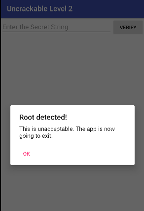
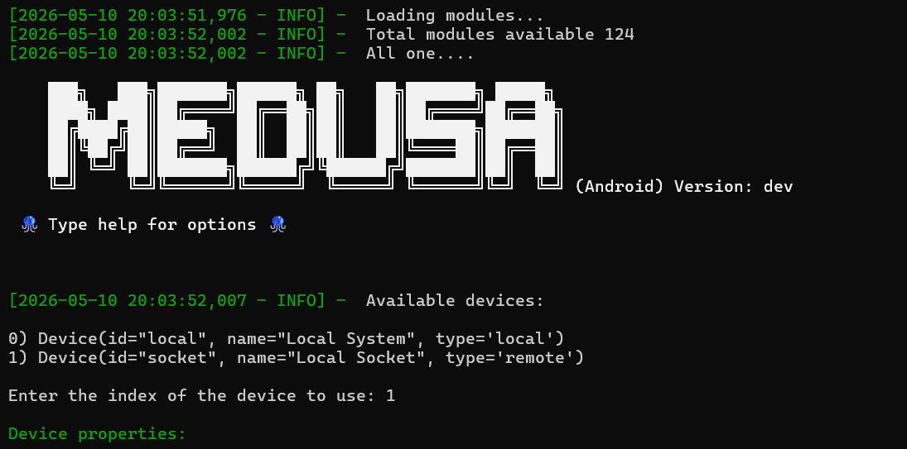
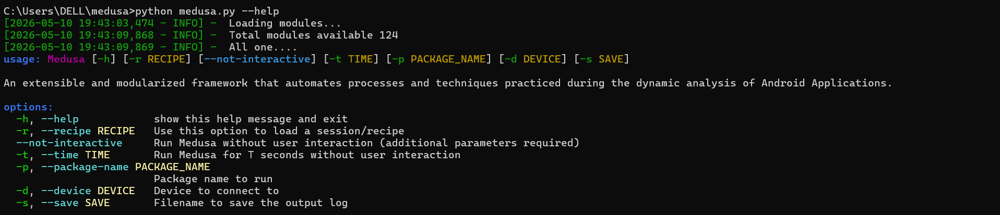
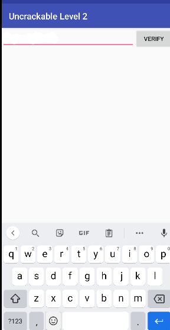

# Lab — Contournement de la Détection Root avec Medusa & Frida

## 📌 Présentation

Ce laboratoire a pour objectif d’étudier les mécanismes de détection de root dans les applications Android et de comprendre comment les neutraliser de manière contrôlée à l’aide de Frida et Medusa.

Le laboratoire repose sur l’instrumentation dynamique afin d’intercepter les vérifications de sécurité réalisées par l’application cible.

⚠️ Ce laboratoire est strictement pédagogique et défensif.

---

# 🎯 Objectifs du Lab

À la fin de ce laboratoire, l’apprenant sera capable de :

- Comprendre comment les applications Android détectent le root
- Utiliser Frida pour injecter des hooks dynamiques
- Utiliser Medusa pour automatiser des bypass Android
- Neutraliser des contrôles Java liés au root
- Vérifier l’exécution des hooks
- Diagnostiquer les échecs de bypass
- Comprendre les limites des hooks Java face aux protections natives

---

# ⚖️ Cadre légal et éthique

Ce laboratoire doit être réalisé uniquement :

- sur un émulateur Android contrôlé,
- sur une application de test autorisée,
- dans un cadre pédagogique ou d’audit défensif.

## ❌ Interdit

- cibler des applications réelles sans autorisation,
- contourner des protections sur des applications tierces,
- exécuter des actions offensives,
- modifier des applications non autorisées.

---

# 🧰 Outils Utilisés

## 1. Frida

Utilisé pour :

- injecter des hooks dynamiques,
- intercepter les appels Java,
- modifier le comportement de l’application en mémoire,
- contourner les mécanismes de détection root.

---

## 2. Medusa

Utilisé pour :

- automatiser les bypass Android,
- charger des modules Frida prêts à l’emploi,
- simplifier l’instrumentation dynamique,
- exécuter des hooks avant le démarrage de l’application.

---

# 📋 Prérequis

- Android Studio
- Émulateur Android
- ADB installé
- Frida installé sur le PC
- frida-server sur Android
- Python installé
- Medusa installé
- Application cible vulnérable (ex: Uncrackable Level 3)

---

# 🔍 Vérifications Initiales

## Vérifier ADB

```bash
adb devices
Vérifier Frida
frida --version
Vérifier Python Frida
python -c "import frida; print(frida.__version__)"
🧱 Étape 1 — État Initial : Détection Root Active

Avant toute manipulation, l’application détecte un environnement rooté et bloque immédiatement son exécution.

Message affiché :

“Rooting or tampering detected.
This is unacceptable.
The app is now going to exit.”
Analyse

L’application effectue plusieurs vérifications :

recherche du binaire su,
vérification de Build.TAGS,
détection de busybox,
contrôles anti-tampering,
vérifications Java et natives.
🧱 Étape 2 — Démarrage de Frida-Server
Commandes utilisées
adb devices
adb shell "/data/local/tmp/frida-server -l 0.0.0.0"
Explication
adb devices

Permet de vérifier que l’émulateur Android est bien connecté.

frida-server

Démarre le serveur Frida sur l’appareil Android afin d’autoriser l’injection dynamique de hooks.

🧱 Étape 3 — Lancement de Medusa

Une fois Frida opérationnel, Medusa peut être lancé.

Medusa détecte automatiquement :

l’émulateur Android,
la version Android,
les propriétés système,
les modules disponibles.
Informations détectées
Android 11
API 30
Fabricant : Google
🧱 Étape 4 — Exécution du Bypass Root
Commande utilisée
python medusa.py --usb --spawn com.example.uncrackable3 --module root-bypass
⚙️ Fonctionnement du Module root-bypass

Le module applique plusieurs hooks Frida.

Hook Build.TAGS

Le hook force :

release-keys

afin d’éviter la détection des builds modifiées.

Hook File.exists()

Lorsque l’application vérifie :

/system/xbin/su

le hook retourne :

false
Hook Runtime.exec()

Les commandes système comme :

su

sont interceptées afin d’empêcher la confirmation du root.

🧱 Étape 5 — Résultat Après le Bypass

Après injection des hooks :

l’alerte de sécurité disparaît,
l’application continue son exécution normalement,
les contrôles root Java sont neutralisés.
🧱 Étape 6 — Vérification des Hooks

Les logs Frida permettent de confirmer :

l’injection des hooks,
les appels interceptés,
les vérifications root bloquées.
🛠 Dépannage Rapide
Root toujours détecté ?

Certaines applications utilisent du code natif C/C++.

Dans ce cas :

activer les Native Hooks Medusa,
intercepter fopen(),
intercepter access(),
vérifier les contrôles JNI.
Vérifier les versions Frida

Le client Frida et frida-server doivent avoir exactement la même version.

frida --version
📚 Références Sécurité

Ce laboratoire s’appuie sur :

OWASP
OWASP MASVS
OWASP MASTG
--- 
# 📷 Screenshots

## 1. Détection root initiale



---

## 2. Console Frida / Medusa



---

## 3. Bypass confirmé



---

## 4. Application sur émulateur


